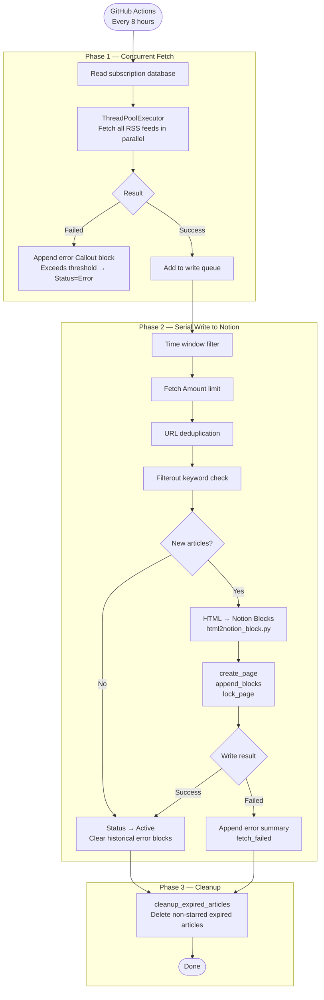

English | [简体中文](./README_ZH.md) | [繁體中文](./README_TW.md)

<div align="center">

# RSS2Notion

**Automatically sync RSS feeds to Notion — build your personal reading space**

[](./LICENSE)
[](https://www.python.org/)

</div>

---


---

## ✨ Features

- **Notion-based subscription management** — Add, edit, and disable RSS sources directly in Notion, no config files needed
- **Feed content rendering** — Converts the HTML content already included in the RSS feed (`content` or `summary` fields) into rich Notion blocks, preserving headings, lists, code blocks, tables, quotes, and inline formatting
- **Image-text layout** — Article images embedded in the feed content are preserved and interleaved with text in Notion pages
- **Smart deduplication** — Timestamp-based filtering + batch URL lookup to efficiently avoid duplicate entries
- **Per-subscription overrides** — Each feed can independently set its own cleanup window (`Cleanup Days`) and article fetch limit (`Fetch Amount`)
- **Keyword filtering** — Per-subscription blocklist (`Filterout`) to skip articles whose title or URL matches specified keywords
- **Cover image extraction** — Automatically picks the first article image or channel logo as the page cover
- **Reading state tracking** — New articles are automatically marked `Unread`; supports `Reading` / `Star` states
- **Source relation** — Each article is linked back to its subscription via Notion Relation
- **Error tracking** — Failed syncs append timestamped error callout blocks to the subscription page; status is upgraded to `Error` after a configurable number of consecutive failures
- **Auto cleanup** — Deletes articles older than the configured window (per-subscription or global) to keep your database tidy
- **Concurrent RSS fetching** — All feeds are fetched in parallel, then written to Notion serially to respect rate limits
- **Page locking** — Newly created article pages are automatically locked to prevent accidental edits
- **OPML import/export** — Bulk-import from an OPML file; export your entire subscription list back to OPML
- **Scheduled via GitHub Actions** — Runs automatically every 8 hours, no server required

---

## 🏗️ How It Works



---

## 🚀 Quick Start

### Prerequisites

- A [Notion](https://www.notion.so/) account
- A GitHub account

### Step 1: Duplicate the Notion Template

Click the link below to duplicate the template into your Notion workspace:

👉 [**Duplicate Notion Template**](https://bcihleln-shared-templates.notion.site/RSS2Notion-d1d5ac361c1583b6a17a01f774e2747f) — click "Duplicate" in the top-right corner.

The template includes two databases:
- **Subscription Database** — Manage your RSS feed sources
- **Reading Database** — Store synced articles

> ⚠️ **Do not rename database properties — the sync will break if property names are changed.**


### Step 2: Create a Notion Integration

1. Go to [Notion Integrations](https://www.notion.so/profile/integrations) and create a new Integration
2. Select your workspace and submit — copy the **Internal Integration Token** (this is your `NOTION_API_KEY`)
3. Configure **Content capabilities** (read/write) for the Integration


### Step 3: Get Database IDs

Extract the database ID from the Notion page URL:

```
https://www.notion.so/your-workspace/xxxxxxxxxxxxxxxxxxxxxxxxxxxxxxxx?v=...
                                     ^^^^^^^^^^^^^^^^^^^^^^^^^^^^^^^^
                                     This 32-character segment is the Database ID
```

- **Articles Database ID** → `NOTION_ARTICLES_DATABASE_ID`
- **Subscription Database ID** → `NOTION_FEEDS_DATABASE_ID`

### Step 4: Fork the Repository and Configure Secrets

1. Click **Fork** in the top-right corner
2. Go to your forked repo → **Settings** → **Secrets and variables** → **Actions**
3. Add the following **Repository Secrets**:

| Secret Name | Description |
|------------|-------------|
| `NOTION_API_KEY` | Notion Integration Token |
| `NOTION_ARTICLES_DATABASE_ID` | Reading Database ID |
| `NOTION_FEEDS_DATABASE_ID` | Subscription Database ID |


4. (Optional) Add the following **Repository Variables**:

| Variable Name | Default | Description |
|--------------|---------|-------------|
| `TIMEZONE` | `Asia/Shanghai` | Timezone in [IANA format](https://en.wikipedia.org/wiki/List_of_tz_database_time_zones) |
| `CLEANUP_DAYS` | `30` | Global retention window (days). Also controls the first-run import window. Set to `-1` to disable auto-cleanup and import all history |

### Step 5: Enable GitHub Actions and Run Manually

1. Go to the **Actions** tab of your repository
2. If prompted, click **I understand my workflows, go ahead and enable them**
3. Select **RSS Sync** on the left → click **Run workflow** to trigger the first sync manually

After that, the sync runs automatically every 8 hours.

> **(Optional) Change the sync frequency**
> Edit the cron expression in `.github/workflows/sync.yml`:
> ```yaml
> - cron: '0 */8 * * *'  # every 8 hours
> ```
> Use [crontab.guru](https://crontab.guru/) to generate expressions.

---

## ⚙️ Configuration

### Environment Variables

| Variable | Required | Default | Description |
|---------|:--------:|---------|-------------|
| `NOTION_API_KEY` | ✅ | — | Notion Integration Token |
| `NOTION_ARTICLES_DATABASE_ID` | ✅ | — | Reading Database ID |
| `NOTION_FEEDS_DATABASE_ID` | ✅ | — | Subscription Database ID |
| `TIMEZONE` | — | `Asia/Shanghai` | IANA timezone name |
| `CLEANUP_DAYS` | — | `30` | Global retention window. `-1` imports all history and disables cleanup |

### Advanced Config (code-level)

These are defined in `rss2notion/utils/config.py` and can be adjusted directly:

| Parameter | Default | Description |
|-----------|---------|-------------|
| `max_import_count` | `5` | Max articles imported per feed when no time window is set (`CLEANUP_DAYS = -1`) |
| `notion_block_limit` | `100` | Max blocks written in the initial page creation call; remainder is appended in a second call |
| `retry_times` | `3` | HTTP retry attempts per Notion API request |
| `retry_delay` | `2.0` | Seconds between retries |
| `mark_err_threshold` | `10` | Number of consecutive error callout blocks on a subscription page before its status is set to `Error` |

---

## 🗃️ Notion Database Schema

### Subscription Database

| Property | Type | R/W | Description |
|----------|------|-----|-------------|
| `Feed Name` | title | Read | Feed display name |
| `URL` | url | Read | RSS feed URL |
| `Status` | select | Write | Sync status: `Active` / `Error` / `Disabled` |
| `Updates` | last_edited_time | Read | Auto-updated by Notion on last edit |
| `Filterout` | multi_select | Read | Keywords — articles whose title or URL contains any keyword are skipped |
| `Articles` | relation | Read | Linked articles count (managed by Notion relation) |
| `Cleanup Days` | number | Read | Per-feed retention window override; empty = use global `CLEANUP_DAYS` |
| `Fetch Amount` | number | Read | Max articles to import per run for this feed; empty = no limit |

### Reading Database

| Property | Type | R/W | Description |
|----------|------|-----|-------------|
| `Name` | title | Write | Article title (links to article URL) |
| `URL` | url | Write | Article link |
| `Published` | date | Write | Publish time |
| `State` | select | Write | Reading state: `Unread` / `Reading` / `Star` |
| `Source` | relation | Write | Linked to the Subscription Database |

---

## 🛠️ Local Development

```bash
# Clone the repository
git clone https://github.com/your-username/RSS2Notion.git
cd RSS2Notion

# Install dependencies (requires Python 3.14+ and uv)
uv sync

# Set environment variables
export NOTION_API_KEY=your_token
export NOTION_ARTICLES_DATABASE_ID=your_reading_db_id
export NOTION_FEEDS_DATABASE_ID=your_subscription_db_id

# Run
uv run python -m rss2notion
```

### OPML Import / Export

```bash
# Import subscriptions from an OPML file
# Edit tools/opml.py and set opml_file_path, then:
uv run python tools/opml.py

# Export all subscriptions to backup.opml
# Uncomment the export_opml line in tools/opml.py, then run the same command
```

---

## 🙏 Acknowledgements

- [lcoolcool/notion-rss-reader](https://github.com/lcoolcool/notion-rss-reader) — Inspiration
- [lcoolcool/RSS-to-Notion](https://github.com/lcoolcool/RSS-to-Notion) — Inspiration
- [feedparser](https://github.com/kurtmckee/feedparser) — RSS parsing
- [beautifulsoup4](https://www.crummy.com/software/BeautifulSoup/) — HTML parsing

---

## 📄 License

This project is licensed under the [MIT License](./LICENSE).
