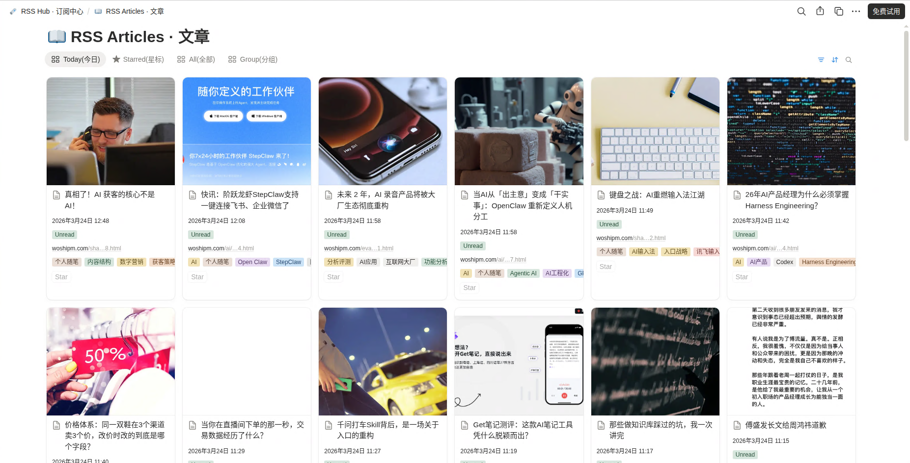
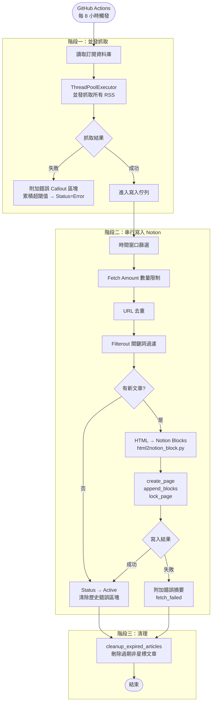
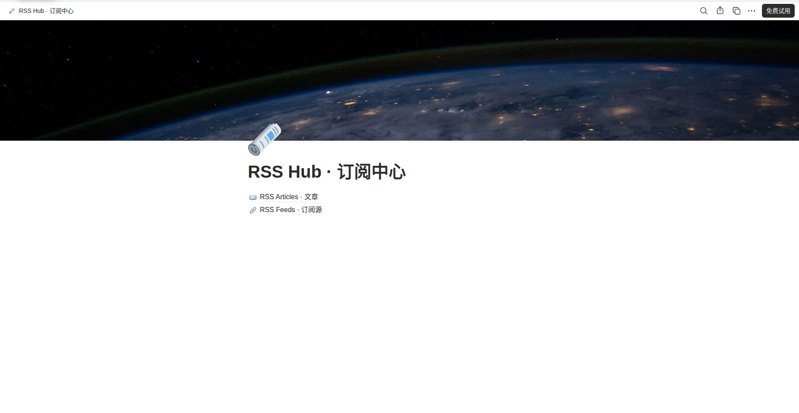
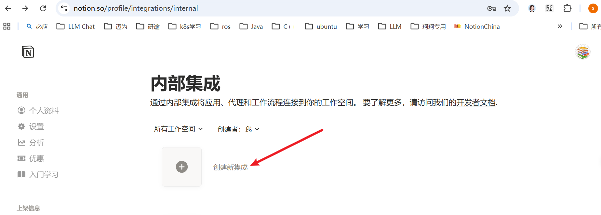
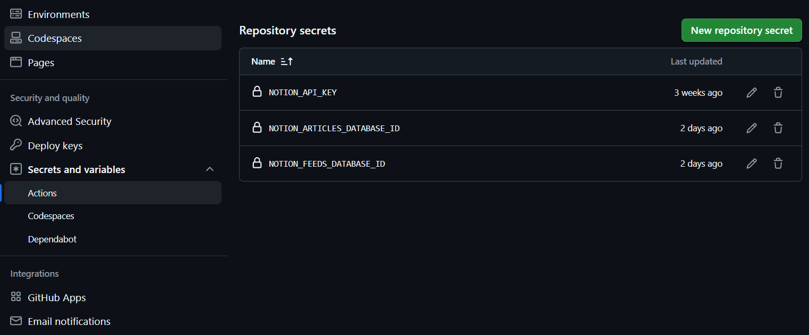

[English](./README.md) | [简体中文](./README_ZH.md) | 繁體中文

<div align="center">

# RSS2Notion

**將 RSS 訂閱自動同步到 Notion，在 Notion 中打造你的個人閱讀空間**

[](./LICENSE)
[](https://www.python.org/)

</div>

---



## 🎯 專案目標：解決什麼，不解決什麼

**本專案解決一個具體問題：** 你已經有一批 RSS 訂閱源，想在 Notion 中閱讀它們——帶有正確的格式渲染、閱讀狀態追蹤和自動清理——而不需要額外的 RSS 閱讀器應用程式。

它是一個同步橋接工具，而非訂閱源產生器。預期工作流程如下：

1. 目標網站已經發布了 RSS/Atom 訂閱源，或有社區分享的訂閱源
2. 本工具拉取該訂閱源，將其中的 HTML 內容渲染為 Notion 塊，並維護你的閱讀資料庫

**明確超出範圍的問題：**

- **為沒有 RSS 的網站產生訂閱源** — 無論是從靜態頁面（CSS 選擇器抓取）還是 JavaScript 渲染的動態頁面產生 RSS，都屬於獨立問題，由單獨的工具解決。
- **從網頁抓取全文** — 本工具只渲染 RSS Feed 中 `content` 或 `summary` 欄位已包含的 HTML 內容。如果訂閱源提供的是截斷摘要，渲染結果也是截斷的。
- **取代通用 RSS 閱讀器** — 沒有額外瀏覽器擴充功能、行動客戶端或稍後閱讀流程。Notion 是唯一的閱讀介面。

如果你的主要需求是為不發布 RSS 的網站*建立*訂閱源，本專案不是合適的起點。

---

## ✨ 功能特性

**Notion 訂閱管理**  
直接在 Notion 中新增、編輯、停用訂閱源，無需修改設定檔，包含：
- **訂閱源關聯** — 透過 Relation 將每篇文章關聯回對應的訂閱源
- **智慧去重** — 基於時間戳篩選 + URL 批次查詢雙重去重，高效避免重複寫入
- **訂閱源級別覆寫** — 每個訂閱可獨立設定清理週期（`Cleanup Days`）和每次抓取數量（`Fetch Amount`）
- **關鍵詞過濾** — 每個訂閱可設定封鎖關鍵詞清單（`Filterout`），標題或連結命中則略過
- **錯誤追蹤** — 同步失敗時自動將帶有時間戳的錯誤 Callout 區塊附加到訂閱頁面；連續失敗次數達到閾值後才升級為 `Error` 狀態

**Feed 內容渲染**  
將 RSS Feed 中已包含的 HTML 內容（`content` 或 `summary` 欄位）轉換為 Notion 塊，保留標題、清單、程式碼區塊、表格、引用及行內格式
- **封面圖提取** — 自動提取文章內圖片或頻道封面作為頁面封面
- **圖文混排** — Feed 內容中的圖片完整保留，圖文交替寫入 Notion 頁面

**文章狀態管理**
- **閱讀狀態追蹤** — 文章自動標記為 `Unread`，支援 `Reading` / `Star` 狀態流轉
- **自動清理** — 定期刪除超出設定時間範圍的文章，保持資料庫整潔（支援訂閱源獨立覆寫）

**其他便利功能**
- **並發 RSS 抓取** — 所有訂閱源並發抓取，寫入 Notion 時串行執行以遵守速率限制
- **頁面自動鎖定** — 新建立的文章頁面自動鎖定，防止在資料庫視圖中誤操作
- **OPML 匯入/匯出** — 支援從 OPML 檔案批次匯入；支援將全部訂閱源匯出為 OPML 檔案
- **GitHub Actions 定時執行** — 每 8 小時自動同步，無需自建伺服器

---

## 🏗️ 運行流程



---

## 🚀 快速開始

### 前置條件

- 一個 [Notion](https://www.notion.so/) 帳號
- 一個 GitHub 帳號

### 步驟 1：複製 Notion 範本

點擊下方連結將範本複製到你的 Notion 工作區：

👉 [**點擊複製 Notion 範本**](https://bcihleln-shared-templates.notion.site/RSS2Notion-d1d5ac361c1583b6a17a01f774e2747f)，點擊右上角「Duplicate」。

範本包含兩個資料庫：
- **訂閱資料庫** — 管理你的 RSS 訂閱源
- **閱讀資料庫** — 存放同步的文章

> ⚠️ **如需修改資料庫 property 的名稱，請同步修改 `.\rss2notion\schema.py` 的配置，否則將無法正常運作**



### 步驟 2：建立 Notion Integration

1. 前往 [Notion Integrations](https://www.notion.so/profile/integrations) 建立新的 Integration
2. 選擇你的工作區，提交後取得 **Internal Integration Token**（即 `NOTION_API_KEY`）
3. 為 Integration 設定內容讀寫權限



### 步驟 3：取得資料庫 ID

從 Notion 資料庫頁面的 URL 中擷取 ID：

```
https://www.notion.so/your-workspace/xxxxxxxxxxxxxxxxxxxxxxxxxxxxxxxx?v=...
                                     ^^^^^^^^^^^^^^^^^^^^^^^^^^^^^^^^
                                     這一段（32 位）即為資料庫 ID
```

- **文章資料庫 ID** → `NOTION_ARTICLES_DATABASE_ID`
- **訂閱資料庫 ID** → `NOTION_FEEDS_DATABASE_ID`

### 步驟 4：Fork 倉庫並設定 Secrets

1. 點擊右上角 **Fork**
2. 進入你 Fork 後的倉庫 → **Settings** → **Secrets and variables** → **Actions**
3. 新增以下 **Repository Secrets**：

| Secret 名稱 | 說明 |
|------------|------|
| `NOTION_API_KEY` | Notion Integration Token |
| `NOTION_ARTICLES_DATABASE_ID` | 文章資料庫 ID |
| `NOTION_FEEDS_DATABASE_ID` | 訂閱資料庫 ID |



4. （可選）新增以下 **Repository Variables**：

| Variable 名稱 | 預設值 | 說明 |
|--------------|--------|------|
| `TIMEZONE` | `Asia/Shanghai` | 時區，使用 [IANA 格式](https://en.wikipedia.org/wiki/List_of_tz_database_time_zones) |
| `CLEANUP_DAYS` | `30` | 全域保留天數，同時控制首次執行的匯入範圍。設為 `-1` 則停用自動清理並匯入全部歷史 |

### 步驟 5：啟用 GitHub Actions 並手動觸發

1. 進入倉庫的 **Actions** 標籤頁
2. 如果看到提示，點擊 **I understand my workflows, go ahead and enable them**
3. 左側選擇 **RSS Sync** → 點擊 **Run workflow** 手動觸發第一次同步

之後每 8 小時自動執行一次。

> **（可選）更改同步頻率**
> 編輯 `.github/workflows/sync.yml` 中的 cron 表達式：
> ```yaml
> - cron: '0 */8 * * *'  # 每 8 小時
> ```
> 可使用 [crontab.guru](https://crontab.guru/) 產生表達式。

---

## ⚙️ 設定說明

### 環境變數

| 環境變數 | 必填 | 預設值 | 說明 |
|---------|:----:|--------|------|
| `NOTION_API_KEY` | ✅ | — | Notion Integration Token |
| `NOTION_ARTICLES_DATABASE_ID` | ✅ | — | 閱讀資料庫 ID |
| `NOTION_FEEDS_DATABASE_ID` | ✅ | — | 訂閱資料庫 ID |
| `TIMEZONE` | — | `Asia/Shanghai` | IANA 時區名稱 |
| `CLEANUP_DAYS` | — | `30` | 全域保留天數；`-1` 則匯入全部歷史資料且停用自動清理 |

### 進階設定（程式碼級）

在 `rss2notion/utils/config.py` 中可直接修改：

| 參數 | 預設值 | 說明 |
|------|--------|------|
| `max_import_count` | `5` | 未設定時間範圍時（`CLEANUP_DAYS = -1`），每個訂閱源單次最多匯入的文章數 |
| `notion_block_limit` | `100` | 建立頁面時首批寫入的 block 上限；超出部分透過第二次 API 呼叫附加 |
| `retry_times` | `3` | 每次 Notion API 請求的重試次數 |
| `retry_delay` | `2.0` | 重試間隔秒數 |
| `mark_err_threshold` | `10` | 訂閱頁面中累積錯誤 Callout 區塊達到該數量後，將狀態升級為 `Error` |

---

## 🗃️ Notion 資料庫說明

### 訂閱資料庫屬性

| 屬性名稱 | 類型 | 工具交互類型 | 說明 |
|----------|------|-------|------|
| `Feed Name` | title | 讀 | 訂閱源顯示名稱 |
| `URL` | url | 讀 | RSS 訂閱連結 |
| `Status` | select | 寫 | 同步狀態：`Active` / `Error` / `Disabled` |
| `Updates` | last_edited_time | 讀 | Notion 自動維護的最後編輯時間 |
| `Filterout` | multi_select | 讀 | 封鎖關鍵詞，標題或連結命中任意詞則略過 |
| `Articles` | relation | 讀 | 已關聯的文章數量（Notion 自動統計） |
| `Cleanup Days` | number | 讀 | 訂閱源級保留天數；空白則沿用全域 `CLEANUP_DAYS` |
| `Fetch Amount` | number | 讀 | 每次最多匯入該訂閱源的文章篇數；空白則不限 |

### 閱讀資料庫屬性

| 屬性名稱 | 類型 | 工具交互類型 | 說明 |
|----------|------|-------|------|
| `Name` | title | 寫 | 文章標題（帶連結） |
| `URL` | url | 寫 | 文章連結 |
| `Published` | date | 寫 | 發佈時間 |
| `State` | select | 寫 | 閱讀狀態：`Unread` / Empty (空狀態表示已閱讀) / `Star` |
| `Source` | relation | 寫 | 關聯到訂閱資料庫 |

---

## 🛠️ 本地開發

```bash
# 複製倉庫
git clone https://github.com/your-username/RSS2Notion.git
cd RSS2Notion

# 安裝相依套件（需要 Python 3.14+ 和 uv）
uv sync

# 設定環境變數
export NOTION_API_KEY=your_token
export NOTION_ARTICLES_DATABASE_ID=your_reading_db_id
export NOTION_FEEDS_DATABASE_ID=your_subscription_db_id

# 執行
uv run python -m rss2notion
```

### OPML 匯入 / 匯出

```bash
# 從 OPML 檔案批次匯入訂閱源
# 編輯 tools/opml.py，設定 opml_file_path，然後：
uv run python tools/opml.py

# 將全部訂閱源匯出為 backup.opml
# 在 tools/opml.py 中取消註解 export_opml 那行，再執行同一指令
```

---

## 🙏 致謝

- [lcoolcool/RSS2Notion](https://github.com/lcoolcool/RSS2Notion) — 專案 Fork 源
- [Yutu0k/RSS-to-Notion](https://github.com/Yutu0k/RSS-to-Notion) — 靈感參考
- [feedparser](https://github.com/kurtmckee/feedparser) — RSS 解析
- [beautifulsoup4](https://www.crummy.com/software/BeautifulSoup/) — HTML 解析

---

## 📄 License

本專案基於 [MIT License](./LICENSE) 開源。
