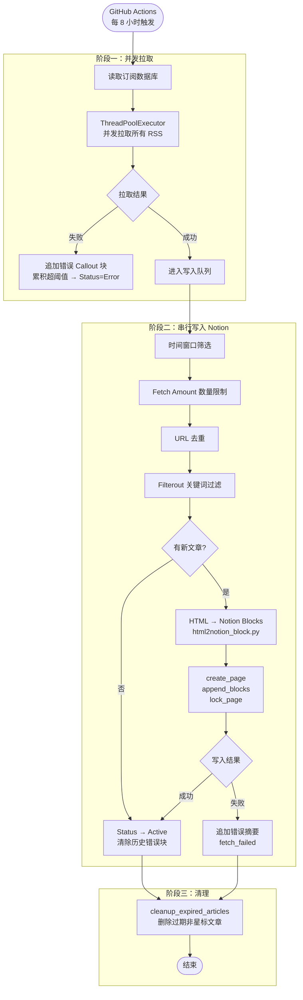

[English](./README.md) | 简体中文 | [繁體中文](./README_TW.md)

<div align="center">

# RSS2Notion

**将 RSS 订阅自动同步到 Notion，在 Notion 中打造你的个人阅读空间**

[](./LICENSE)
[](https://www.python.org/)

</div>

---


---

## ✨ 功能特性

- **Notion 订阅管理** — 直接在 Notion 中增删改查订阅源，无需修改配置文件
- **Feed 内容渲染** — 将 RSS Feed 中已包含的 HTML 内容（`content` 或 `summary` 字段）转换为 Notion 块，保留标题、列表、代码块、表格、引用及行内格式
- **图文混排** — Feed 内容中的图片完整保留，图文交替写入 Notion 页面
- **智能去重** — 基于时间戳过滤 + URL 批量查询双重去重，高效避免重复写入
- **订阅源级别覆写** — 每个订阅可独立设置清理周期（`Cleanup Days`）和每次抓取数量（`Fetch Amount`）
- **关键词过滤** — 每个订阅可设置屏蔽关键词列表（`Filterout`），标题或链接命中则跳过
- **封面图提取** — 自动提取文章内图片或频道封面作为页面封面
- **阅读状态追踪** — 文章自动标记为 `Unread`，支持 `Reading` / `Star` 状态流转
- **订阅源关联** — 通过 Relation 将每篇文章关联回对应的订阅源
- **错误追踪** — 同步失败时自动将带时间戳的错误 Callout 块追加到订阅页面；连续失败次数达到阈值后升级为 `Error` 状态
- **自动清理** — 定期删除超出配置时间窗口的文章，保持数据库整洁（支持订阅源独立覆写）
- **并发 RSS 拉取** — 所有订阅源并发抓取，写入 Notion 时串行执行以遵守速率限制
- **页面自动锁定** — 新创建的文章页面自动锁定，防止在数据库视图中误操作
- **OPML 导入/导出** — 支持从 OPML 文件批量导入；支持将全部订阅源导出为 OPML 文件
- **GitHub Actions 定时运行** — 每 8 小时自动同步，无需自建服务器

---

## 🏗️ 运行流程



---

## 🚀 快速开始

### 前置条件

- 一个 [Notion](https://www.notion.so/) 账号
- 一个 GitHub 账号

### 步骤 1：复制 Notion 模板

点击下方链接将模板复制到你的 Notion 工作区：

👉 [**点击复制 Notion 模板**](https://bcihleln-shared-templates.notion.site/RSS2Notion-d1d5ac361c1583b6a17a01f774e2747f)，点击右上角"Duplicate"。

模板包含两个数据库：
- **订阅数据库** — 管理你的 RSS 订阅源
- **阅读数据库** — 存放同步的文章

> ⚠️ **如需修改数据库 property 的名称，请同步修改 `.\rss2notion\schema.py` 的配置，否则将无法正常工作**


### 步骤 2：创建 Notion Integration

1. 前往 [Notion Integrations](https://www.notion.so/profile/integrations) 创建新的 Integration
2. 选择你的工作区，提交后获取 **Internal Integration Token**（即 `NOTION_API_KEY`）
3. 为 Integration 配置内容读写权限


### 步骤 3：获取数据库 ID

从 Notion 数据库页面的 URL 中提取 ID：

```
https://www.notion.so/your-workspace/xxxxxxxxxxxxxxxxxxxxxxxxxxxxxxxx?v=...
                                     ^^^^^^^^^^^^^^^^^^^^^^^^^^^^^^^^
                                     这一段（32位）即为数据库 ID
```

- **文章数据库 ID** → `NOTION_ARTICLES_DATABASE_ID`
- **订阅数据库 ID** → `NOTION_FEEDS_DATABASE_ID`

### 步骤 4：Fork 仓库并配置 Secrets

1. 点击右上角 **Fork**
2. 进入你 Fork 后的仓库 → **Settings** → **Secrets and variables** → **Actions**
3. 添加以下 **Repository Secrets**：

| Secret 名称 | 说明 |
|------------|------|
| `NOTION_API_KEY` | Notion Integration Token |
| `NOTION_ARTICLES_DATABASE_ID` | 文章数据库 ID |
| `NOTION_FEEDS_DATABASE_ID` | 订阅数据库 ID |


4. （可选）添加以下 **Repository Variables**：

| Variable 名称 | 默认值 | 说明 |
|--------------|--------|------|
| `TIMEZONE` | `Asia/Shanghai` | 时区，使用 [IANA 格式](https://en.wikipedia.org/wiki/List_of_tz_database_time_zones) |
| `CLEANUP_DAYS` | `30` | 全局保留天数，同时控制首次运行的导入范围。设为 `-1` 则禁用自动清理并导入全部历史 |

### 步骤 5：启用 GitHub Actions 并手动触发

1. 进入仓库的 **Actions** 标签页
2. 如果看到提示，点击 **I understand my workflows, go ahead and enable them**
3. 左侧选择 **RSS Sync** → 点击 **Run workflow** 手动触发第一次同步

之后每 8 小时自动运行一次。

> **（可选）更改同步频率**
> 编辑 `.github/workflows/sync.yml` 中的 cron 表达式：
> ```yaml
> - cron: '0 */8 * * *'  # 每 8 小时
> ```
> 可使用 [crontab.guru](https://crontab.guru/) 生成表达式。

---

## ⚙️ 配置说明

### 环境变量

| 环境变量 | 必填 | 默认值 | 说明 |
|---------|:----:|--------|------|
| `NOTION_API_KEY` | ✅ | — | Notion Integration Token |
| `NOTION_ARTICLES_DATABASE_ID` | ✅ | — | 阅读数据库 ID |
| `NOTION_FEEDS_DATABASE_ID` | ✅ | — | 订阅数据库 ID |
| `TIMEZONE` | — | `Asia/Shanghai` | IANA 时区名称 |
| `CLEANUP_DAYS` | — | `30` | 全局保留天数；`-1` 则导入全部历史数据且禁用自动清理 |

### 高级配置（代码级）

在 `rss2notion/utils/config.py` 中直接修改：

| 参数 | 默认值 | 说明 |
|------|--------|------|
| `max_import_count` | `5` | 未设置时间范围时（`CLEANUP_DAYS = -1`），每个订阅源单次最多导入的文章数 |
| `notion_block_limit` | `100` | 创建页面时首批写入的 block 上限；超出部分通过第二次 API 调用追加 |
| `retry_times` | `3` | 每次 Notion API 请求的重试次数 |
| `retry_delay` | `2.0` | 重试间隔秒数 |
| `mark_err_threshold` | `10` | 订阅页面中累积错误 Callout 块达到该数量后，将状态升级为 `Error` |

---

## 🗃️ Notion 数据库说明

### 订阅数据库属性

| 属性名 | 类型 | 工具交互类型 | 说明 |
|--------|------|-------|------|
| `Feed Name` | title | 读 | 订阅源显示名称 |
| `URL` | url | 读 | RSS 订阅链接 |
| `Status` | select | 写 | 同步状态：`Active` / `Error` / `Disabled` |
| `Updates` | last_edited_time | 读 | Notion 自动维护的最后编辑时间 |
| `Filterout` | multi_select | 读 | 屏蔽关键词，标题或链接命中任意词则跳过 |
| `Articles` | relation | 读 | 已关联的文章数量（Notion 自动统计） |
| `Cleanup Days` | number | 读 | 订阅源级保留天数；为空则沿用全局 `CLEANUP_DAYS` |
| `Fetch Amount` | number | 读 | 每次最多导入该订阅源的文章篇数；为空则不限 |

### 阅读数据库属性

| 属性名 | 类型 | 工具交互类型 | 说明 |
|--------|------|-------|------|
| `Name` | title | 写 | 文章标题（带链接） |
| `URL` | url | 写 | 文章链接 |
| `Published` | date | 写 | 发布时间 |
| `State` | select | 写 | 阅读状态：`Unread` / Empty (空状态表示已阅读) / `Star` |
| `Source` | relation | 写 | 关联到订阅数据库 |

---

## 🛠️ 本地开发

```bash
# 克隆仓库
git clone https://github.com/your-username/RSS2Notion.git
cd RSS2Notion

# 安装依赖（需要 Python 3.14+ 和 uv）
uv sync

# 配置环境变量
export NOTION_API_KEY=your_token
export NOTION_ARTICLES_DATABASE_ID=your_reading_db_id
export NOTION_FEEDS_DATABASE_ID=your_subscription_db_id

# 运行
uv run python -m rss2notion
```

### OPML 导入 / 导出

```bash
# 从 OPML 文件批量导入订阅源
# 编辑 tools/opml.py，设置 opml_file_path，然后：
uv run python tools/opml.py

# 将全部订阅源导出为 backup.opml
# 在 tools/opml.py 中取消注释 export_opml 行，再运行同一命令
```

---

## 🙏 致谢

- [Yutu0k/RSS-to-Notion](https://github.com/Yutu0k/RSS-to-Notion) — 灵感参考
- [lcoolcool/RSS2Notion](https://github.com/lcoolcool/RSS2Notion) — 项目 Fork 源
- [feedparser](https://github.com/kurtmckee/feedparser) — RSS 解析
- [beautifulsoup4](https://www.crummy.com/software/BeautifulSoup/) — HTML 解析

---

## 📄 License

本项目基于 [MIT License](./LICENSE) 开源。
